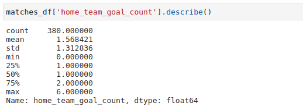
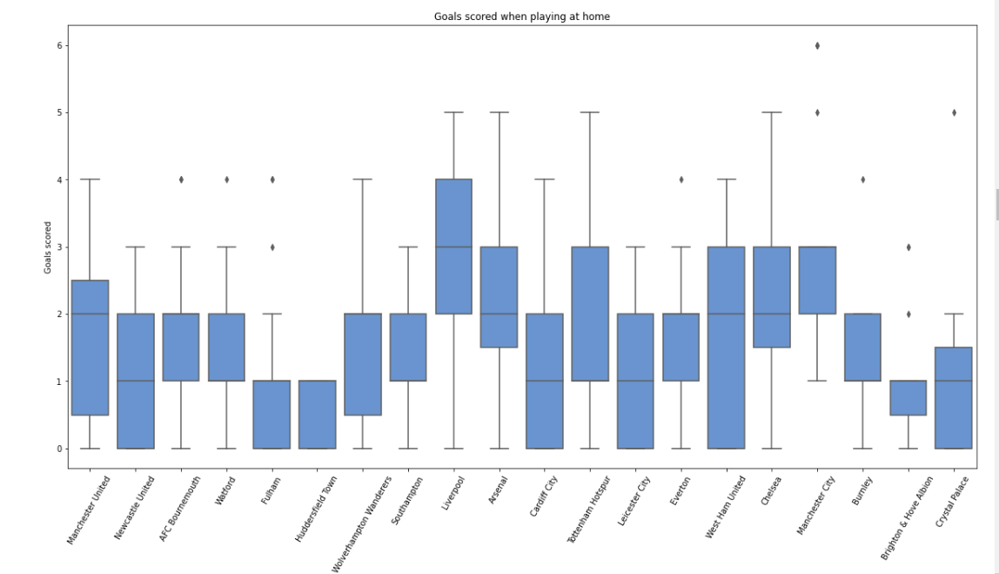
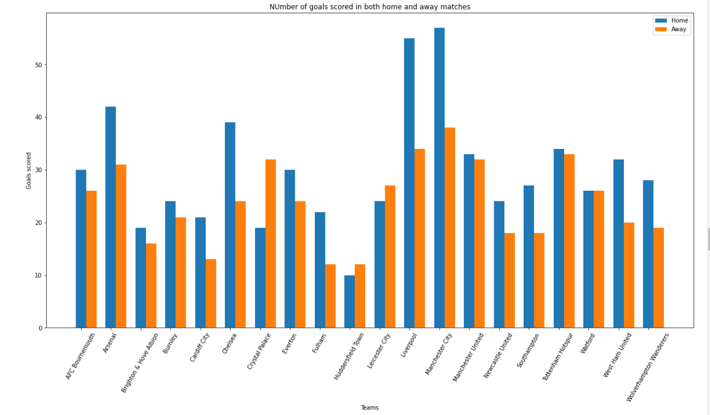
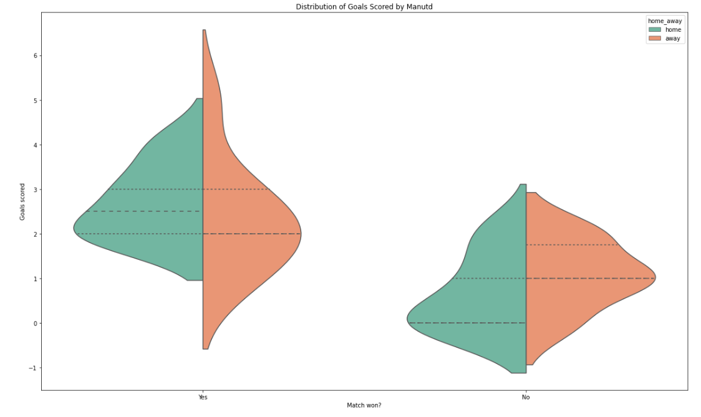
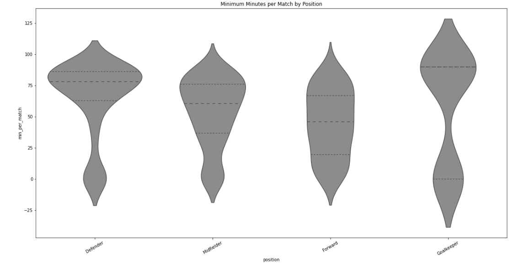

I bumped onto the data on the 2018/19 EPL season online. Being a huge football fan myself, I was keen to find some interesting 
insight out of the data. I was not disappointed. Below are some of the observations I made.

#### Data Used

I obtained data from the website [FootyStats](https://www.footystats.org/stats)

#### Analysis

Let’s begin by looking at some summary statistics for the season.



<!-- ```py
def test():
    print('Test')
```

<<engine='python', engine.path='python3'>>=
def test():
    print('Test')
@ -->

As represented in the snippet above, there were 380 games played in the course of the 2018/19 season. 
The most number of goals scored by any home team was 6. On average, home teams scored about 1.5 goals during the whole season.



The graph above represents the distribution of goals scored by home teams during the season.

Manchester United, for example, scored between 0 and 4 goals in their home games, with the goals concentrated around 2. This means that 
Manutd almost always scored 2 goals at home during the whole season. Liverpool, on the other hand, scored 3 goals on average at Anfield.
Coincidentally, Man City averaged the same number of goals at Etihad.

The number of goals scored by each team can be broken down further as shown in the graph below.



The graph depicts the number of goals scored in home and away games for all the teams. All teams apart from Crystal Palace and Leicester 
City scored more home goals than away goals.



The graph plotted above shows the distribution of goals scored by Manutd, in both home and away matches; and for matches where they won 
and those they did not.

The data suggests that Manutd averaged about 2.5 goals at home for the games they won while they averaged 2 goals for away games won.

On the other hand, Manutd averaged about 0 goals for the home teams they did not win, and about 1 goal for the away games they did not win.

With hindsight, I know that Manutd probably did not have the best defense in the league in 2018/19. For this reason, they needed to score 
more than once to be sure of the win. This is consistent with the information portrayed in the graph, although we cannot exactly pin it down 
to that.



The graph above displays the minimum minutes per match players in each position played.
Defenders, on average, played a minimum of just over 75 minutes per match in 2018/19, with the majority of them playing between 57 and 85 minutes.

Most midfielders played between 30 and 75 minutes per game. On average midfielders would expect a game time of just over 70 minutes per match.

Forwards played about 45 minutes per game on average, with most of them playing between 15 and 70 minutes per game.
The graph for goalkeepers is slightly more complicated. The graph suggests two main concentration points. A goalkeeper in 2018/19 
would either expect to play close to 0 minutes per game or play the whole game. This, as well, is consistent with the model that we 
witness for goalkeepers daily.