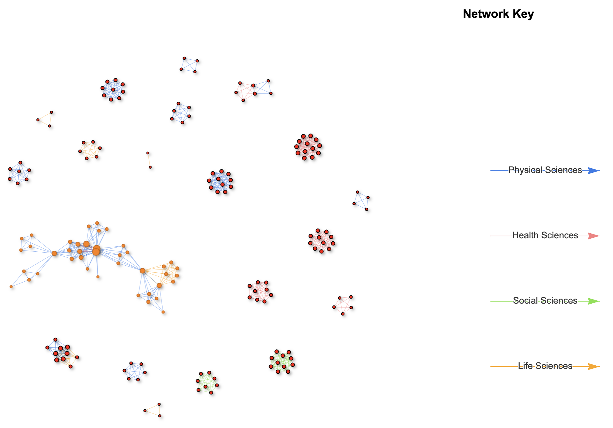
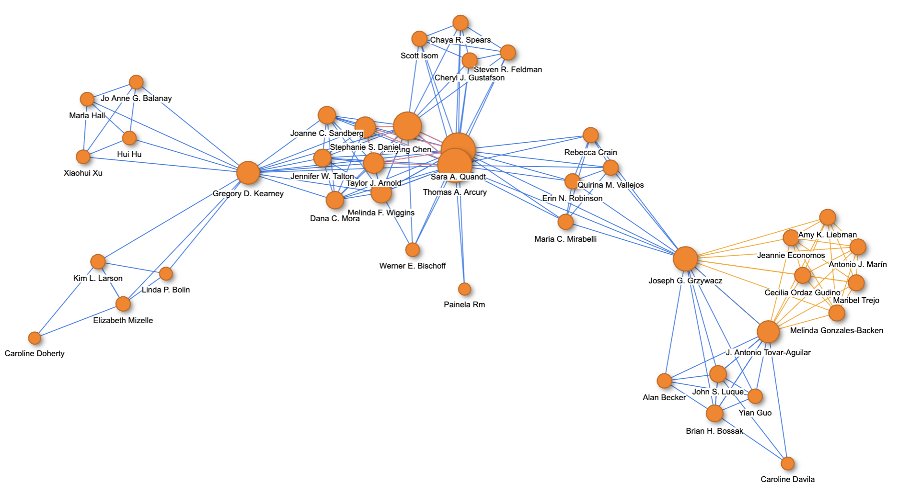
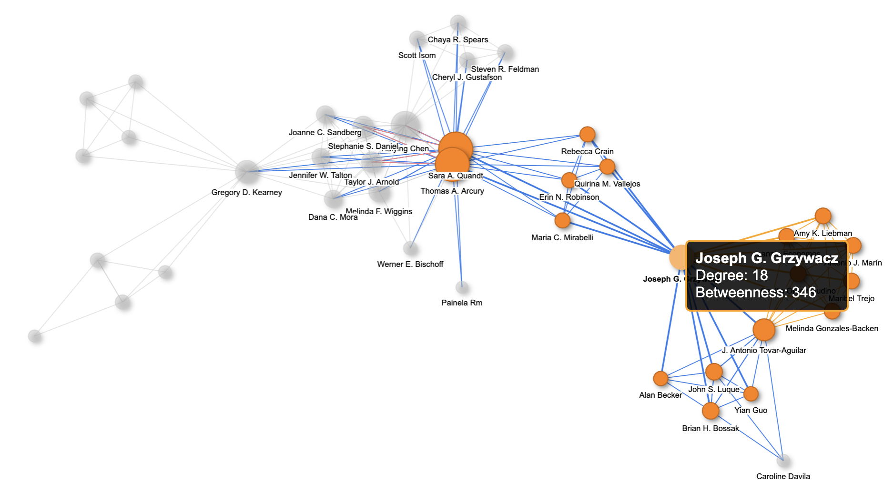
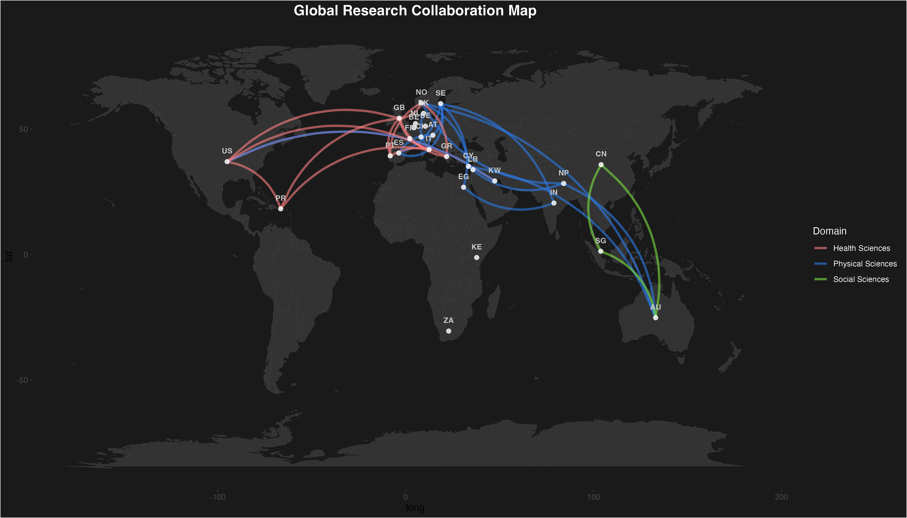
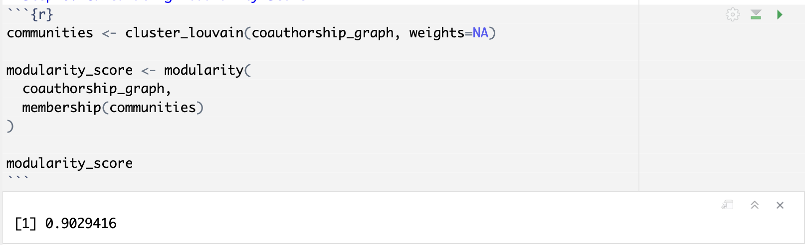

Researchers ordinarily collaborate to write papers. If you have ever wondered how far and wide the collaboration goes or have ever wanted to know who the most published researchers in a particular field are, then this post is for you.

#### Data

The analysis focused on authors who researched about heat exposure in migrant workers. The search was sourced from [the PubMed research paper repository](https://pubmed.ncbi.nlm.nih.gov/advanced/) using the keywords below:
```
(migrant worker OR immigrant worker) AND (stove OR kiln OR high temperature OR thermal OR industrial heat OR burn OR heat OR climate change OR sun OR fever OR hot weather OR warmth)
```
The resultant data contained details about the title of the papers and names of the authors without going into detail about the affilition or citizenship of the authors themselves. For this reason, enrichment was necessary.
The enrichment was done using a Python Script that consumed from [the OpenAlex API](https://openalex.org/).

#### Tools

1. The main analysis was done in R, making use of the following libraries:
    1. Igraph and visNetwork for generation of the network.
    2. Jsonlite for loading the JSON data.
    3. Dplyr and Tidyr for manipulation and transformation of the data.
    4. Scales to rescale node sizes. Larger nodes denote higher degree centrality in our case.
    5. maps to generate a map rendering of the information
2. A Python script was used to enrich the original data; to fetch author affiliations and research paper domains.


#### Objectives

This study aimed at uncovering the following information:
1. To analyze collaboration of the authors by centrality measures, including:
    1. Degree centrality - the number of collaborations an author has.
    2. Betweenness centrality - the number of minimum spanning trees that pass through the node.
2. To identify influential authors. These not only collaborate on many papers (denoted with a high degree centrality) but also act as bridges for connecting researchers in their field (high betweenness centrality).
3. To map research clusters/communities.

#### Data preparation

The data was prepared by building a graph structure out of the data sourced from the research repository. 
Nodes were used to denote authors while edges represented collaboration between authors.
The result was an undirected graph that contained 176 unique authors and 688 unique co-authorship pairs.
The size of the nodes correspond to the degree centrality of the author - the higher the degree centrality of the author the large the node used to represent them. 

#### Analysis and results

20 distinct components/communities were observed, with the largest one consisting of 41 authors.
The papers were found to have been written with a focus on either Health Sciences, Life Sciences, Physical Sciences or Social Sciences. 
This is also encoded in the network by the use of different colours as shown in the image below.



Zooming into each component clearly shows the main authors as well as the domain of the research paper. For example, in the main component Sara Quandt and Thomas Arcury emerge as the most productive authors (going by degree centrality) in the main component.
It is also evident that there was cross-domain collaboration, going by the fact that there are edges of different colours in the component.



Hovering over a node brings up their centrality measures; both degree and betweenness. For example, Joseph Grzywacz had a degree centrality of 18 and betweenness centrality of 346.



Europe was found to be the hub for the papers under consideration based on the fact that majority of the nodes occur in the continent. Interestingly, collaboration regarding Social Sciences was only witnessed in the Australasian continent.



#### A word on communities

Community detection was done using the modularity score, which describes how well a graph can be divided into subgraphs. In other words, the modularity score gives how separated are the different vertex types from each other.
Its values range from -1 to 1. A negative score value means combinations are random and communities cannot clearly be defined.
A positive score means there is a significant division into communities, with more edges within communities than expected by chance.
The high modularity score of 0.9029416 implied the presence of a strong community structure. This is also validated by the well-separated subgraphs seen in the zoomed out image shown above.



#### Source code

The source code the above networks can be found [on Github](https://github.com/CollinsOduor/Collaboration-Network-Analysis).

#### CRediT

The network described in this post was achieved through (you guessed it) collaborative effort.
Thanks to (in alphabetical order) Denis Koome, Diana Otieno, Methusellah Amtany, Michelle Kalevela, Nehema Mburuki, Wendy Oira and Wesley Gathua for their help in writing different pieces of the code for this network.