Customer churn occurs when customers stop subscribing to, or consuming the products of a provider.
Churn is broadly categorized into two - voluntary or involuntary. Voluntary churn occurs when, for example, 
the customer moves to a rival provider while involuntary churn occurs from things out of the customer's control such as death.

Customer acquisition is costed at different rates for different industries. However, it is a general consensus that keeping 
hold of existing customers is usually the cheaper option. The law of large numbers theorizes that with a large enough sample
one should be able to reliable predict a paramater of the population the sample was drawn from. This means that patterns seen 
in the sample can also be generalized for the whole population.

It is important to note that churn cannot be stopped entirely (especially involuntary churn) but experts argue that a rate of 
[between 5% - 7%](https://www.cobloom.com/blog/churn-rate-how-high-is-too-high#:~:text=Churn%20Rate%20Benchmarks&text=...an%20acceptable%20churn%20rate,you%20measure%20customers%20or%20revenue.) 
annually is good enough. Anything below that is a bonus, but values 7% could mean massive losses for a business.

For this analysis, I obtained data from kaggle.

The code, as always, is availble on [my Github](https://github.com/CollinsOduor/churn_analysis).

## Exploratory Analysis

The data had 10000 instances, with 14 dimensions as shown below;

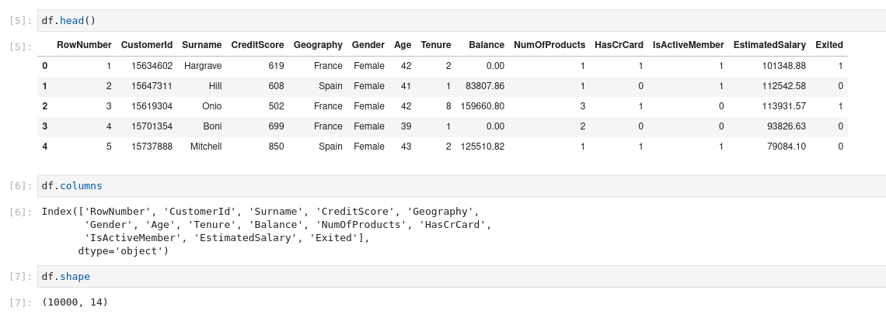

Of the 10,000 records, about 20% eventually left as shown in the pie chart below;

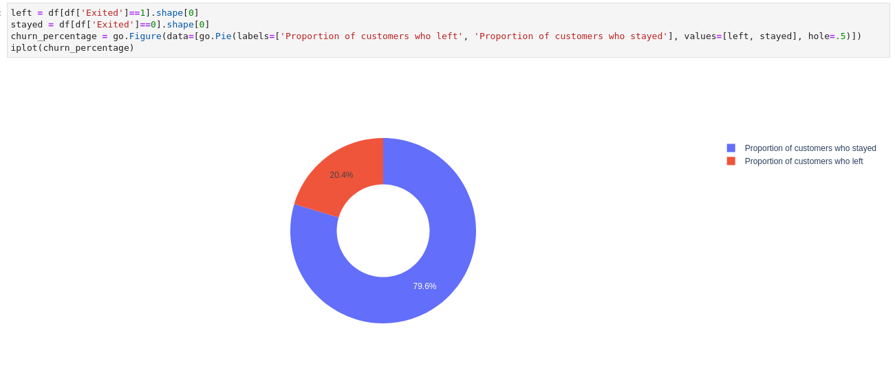

It was my expectation that customers from the three different locations would exhibit different patterns. However, this was not the case
as the characteristics were similar in almost every aspect - save for the frequency of customers from each location. Could it be that 
the setup within the European Union effectively nullifies any difference that might exist amongst the nations?

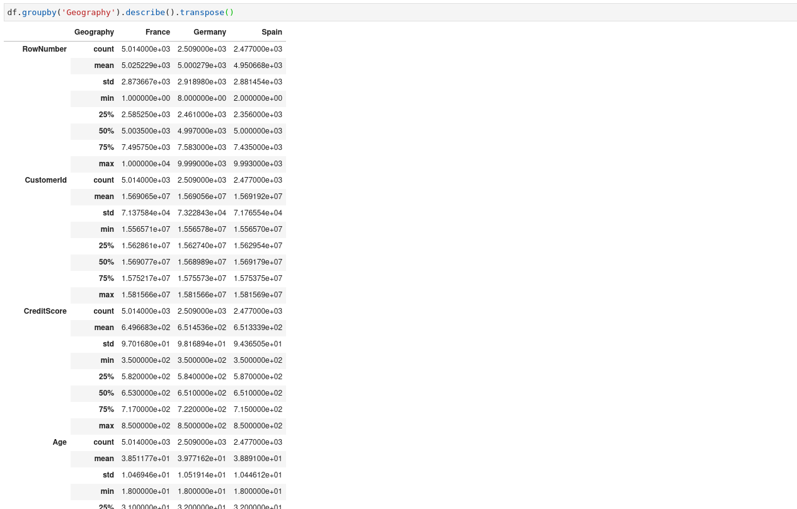

#### Issues with the Data

The data had not one missing value, which makes sense since this was data from a financial institution, and those make sure to 
obtain as much information as necessary from the customer before providing any service.

However, there were some data tidiness issues noted;

1. The columns RowNumber, CustomerId and Surname are used to identify a single record and did not show any correlation to the customer
churning or not.
2. The columns Geography and Gender are captured as strings.

#### Data Cleaning

1. Remove the columns RowNumber, CustomerId and Surname.
2. Encode the columns Geography and Gender as numerical values.

The cleaning process results in data that can be used for modelling;

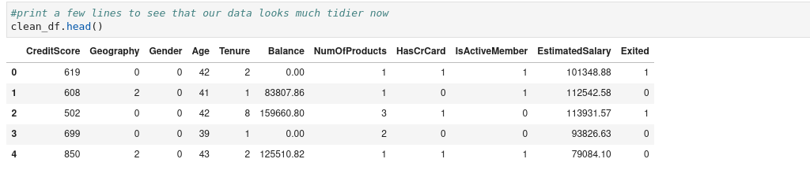

## Modelling

The features display low correlation to the target as shown below;

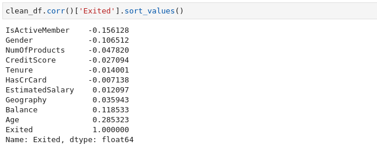

I used neearest neighbors classifier for the task, achieving an initial accuracy of 68% (using number of neighbors as 1, 
and feeding the data as is).

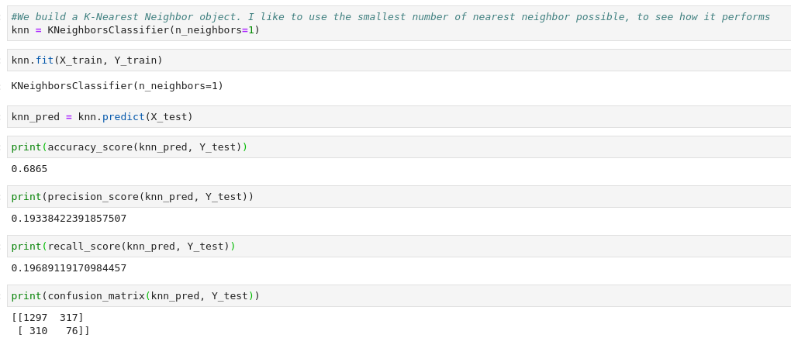

## Optimization

#### Scaling

That the features lie on different scales may throw the classifier off balance. For example, features with high values 
might be deemed more important than the others - this may not be necessarily true. Notice, in the image below, how much
discrepancy exists between the features;

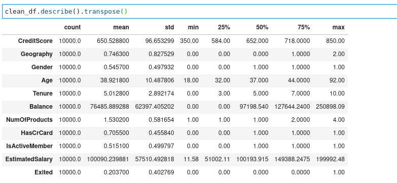

And now the same data after scaling;

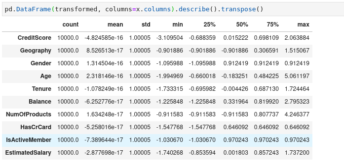

The features now are not very different, with respect to their measures of center. This means that no single feature 
will be mistakenly taken to be more important than the other.

On scaling the data, I was able to improve the accuracy to about 80%

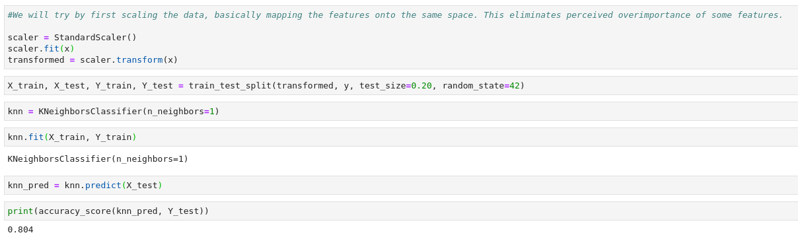

#### Optimizing k

Using k=1 also means that any new datapoint will be assigned the label of its nearest datapoint. This might cause problems, 
especially in the case of an outlier. Here, I classified the same data using 40 different values of k, and computed the values
of k with the least mean error.

As highlighted in the graph below, I found the most optimal value of k to be 23.

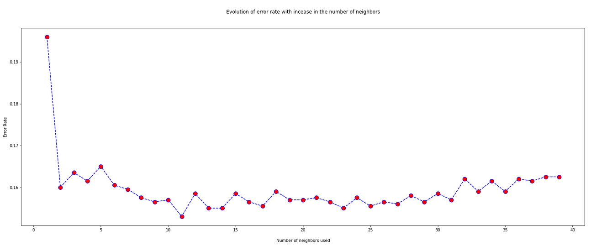

Using 23 nearest neighbors lifted my accuracy to 84.5%.

##### Enumerating the principal components
84.5% is a pretty good accuracy, but I wanted to push it a little higher. PCA finds the bias in data by trying to explain the 
reason for the largest variability in the data. This, I hoped would make the classification even more obvious.

Using PCA to reduce the dimensions did not really help. Being that the data did not have glaring differences made it difficult 
for PCA to cluster the data into distinct groups. This step did not improve the performance significantly, and so it was emitted.

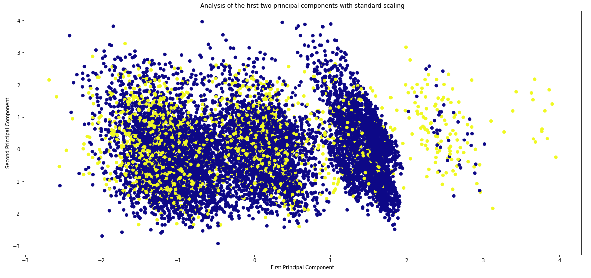

In the end, I had to settle for the 84.5% accuracy.

That we can reliably tell whether a customer is likely to jump ship or not (with almost 85% accuracy) is very important. 
A business can put measures in place to reach out to those who are most likely to churn. This will significanlty reduce 
operational cost, and could also lead to averting some churn - which, as discussed in the first paragraph - is very expensive.