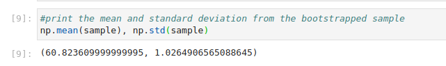
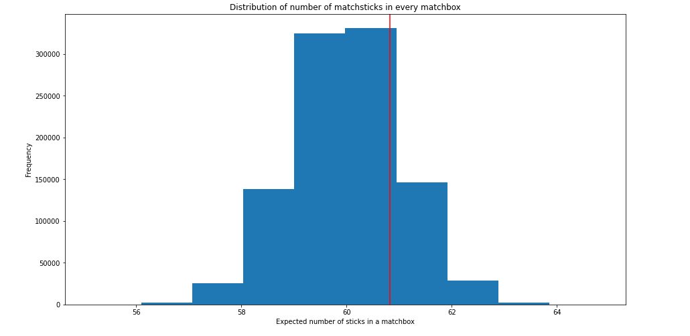
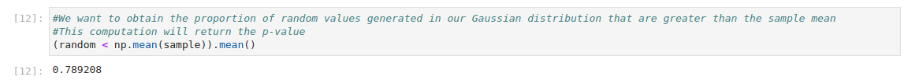

I was shopping in a Nairobi store when I noticed a matchbox labelled as having 60 sticks inside. With a lot of time on my hands 
(mainly due to the pandemic) I decided to put this claim to the test.

I stratified Nairobi into four zones, and randomly bought the same brand of matchsticks from at least a store in each zone. Guided by
the central limit theorem, I generated a larger sample from the 60 boxes I collected.

I have to mention my niece Tamara, and my nephew, Tulani who helped me in sampling. This post would not be possible without them.

This code from which this report was written can be found [here](https://github.com/CollinsOduor/matchsticks_hypothesis_testing)

I performed the study by following the steps outlined below;
1. Taking random samples from different stores
2. Counting the number of sticks in each matchbox
3. Calculating the summary statistics of the samples taken
4. Bootstrapping from the sample pool, to generate a large enough simulation of the match boxes
5. Generating the expected Gaussian distribution
6. Measuring how likely the Gaussian distribution generated by the sample statictics would spawn the research value

The mean and standard deviation of the sample was found out as follows;

If data was generated from the null, we would expect it to look something like this;

The histogram plot represents the normal distribution generated using a mean of 60, and standard deviation of about 1.02.
Our observed expected value of 60.8 is within a standard deviation of the mean of the distribution. This is indication of
the possibility of our observed statistic being generated from the null.

A more scientific approach would be to use the p-value. A high p-value such as 0.78 as witnessed provides concrete support
for the null hypothesis. We, thus, fail to reject the null hypothesis in favor of the alternative.